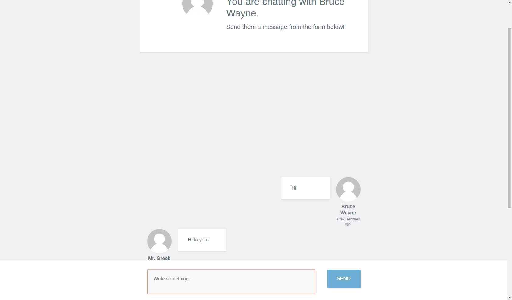

## You are welcome to have a small chat with node! :rocket:

This is a small application running on ***heroku*** that lets you chat to other people. 

<p align="center"> 

</p>

## Tjek this :poop: out! 

Try it out live [here](https://chat-practice.herokuapp.com/), you may have to accept that the site is not secure, after that just follow the instructions and send the invite to a friend. If you use your real email-adress you should be able to see your own avatar in the chat! :smiley:


## Project Info

    "ejs": "^1.0.0",
    "express": "^4.8.2",
    "gravatar": "~1.0.6",
    "socket.io": "1.0.6"

## Local Version

If you have cloned the repository please run:

```
npm install && npm start
```
Have fun! :hamster:
